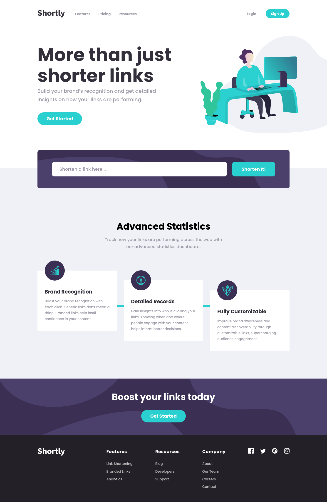
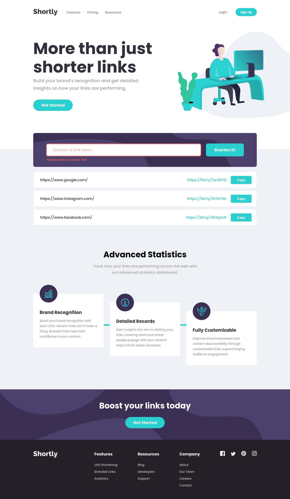
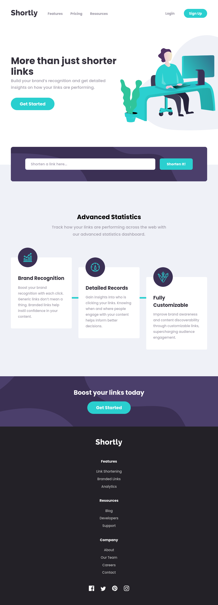
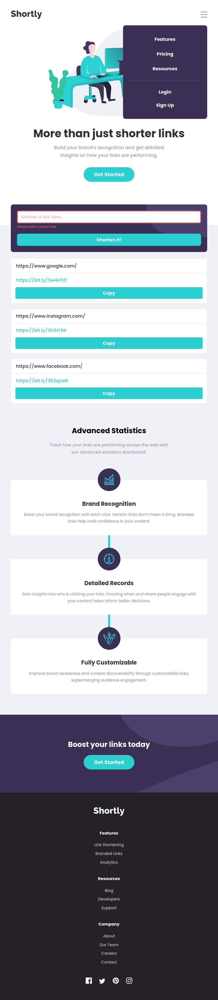
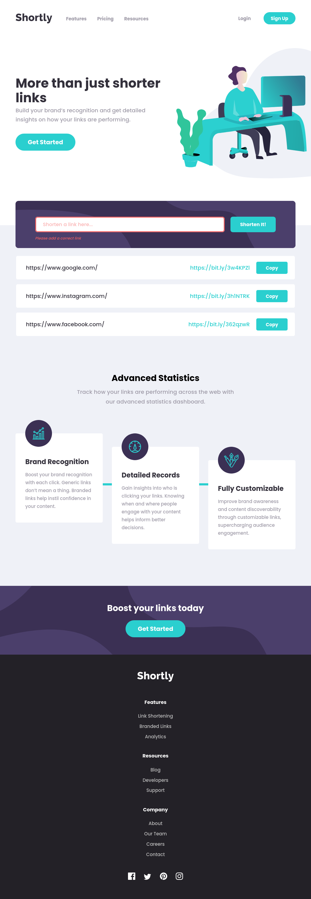
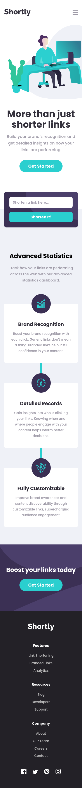
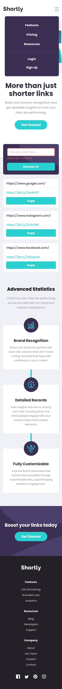

# Frontend Mentor - Shortly URL shortening API Challenge solution

This is a solution to the [Shortly URL shortening API Challenge challenge on Frontend Mentor](https://www.frontendmentor.io/challenges/url-shortening-api-landing-page-2ce3ob-G). Frontend Mentor challenges help you improve your coding skills by building realistic projects. 

## Table of contents

- [Overview](#overview)
  - [The challenge](#the-challenge)
  - [Screenshot](#screenshot)
  - [Links](#links)
- [My process](#my-process)
  - [Built with](#built-with)
  - [What I learned](#what-i-learned)
  - [Useful resources](#useful-resources)
- [Author](#author)

## Overview

### The challenge

Users should be able to:

- View the optimal layout for the site depending on their device's screen size
- Shorten any valid URL
- See a list of their shortened links, even after refreshing the browser
- Copy the shortened link to their clipboard in a single click
- Receive an error message when the `form` is submitted if:
  - The `input` field is empty

### Screenshot

  
Desktop

  
Tablet

  
Mobile

### Links

- Solution URL: [Frontend Mentor Solution](https://www.frontendmentor.io/solutions/url-shortening-api-landing-page-using-gulp-sass-js-api-bem-html-ZdPAS8ljr)
- Live Site URL: [Github Pages](https://rmzvr.github.io/url-shortening-api/)

## My process

### Built with

- Semantic HTML5 markup
- BEM
- SASS
- CSS variables
- JS
- Gulp
- API
- Mobile-first workflow

### What I learned

Creating this project was my first time using mobile-first workflow. Also, it was my first experience using third-party API. For sure, I improved my configuration file gulp and deeply understood how it works.

## Author

- [Github](https://github.com/rmzvr)
- [LinkedIn](https://www.linkedin.com/in/rmzvr)
- [Codewars](https://www.codewars.com/users/rmzvr)
- [Frontend Mentor](https://www.frontendmentor.io/profile/rmzvr)
